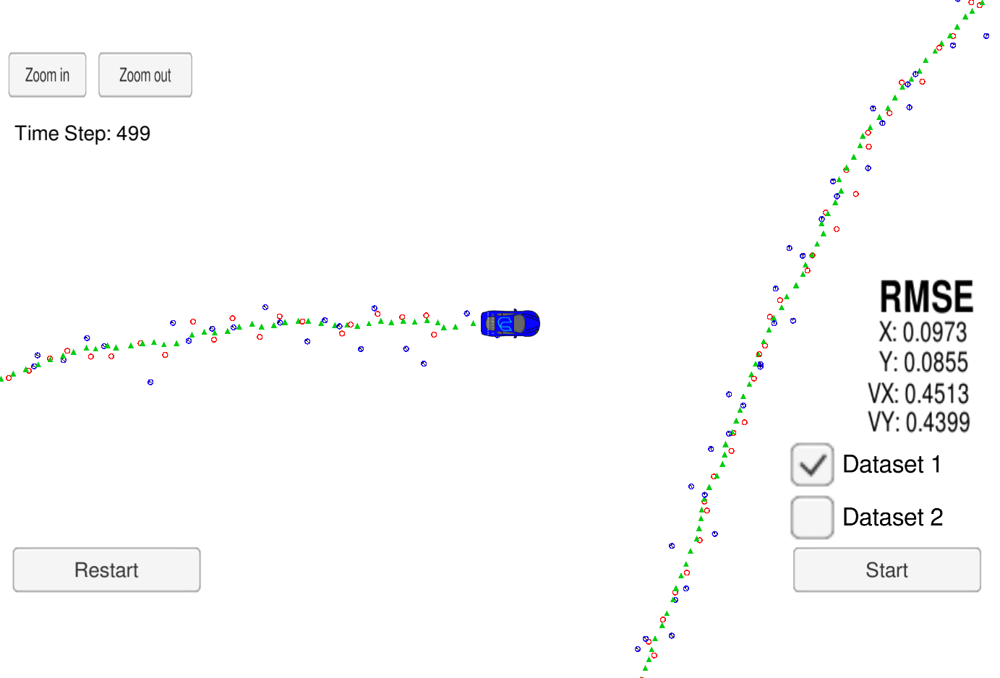

# Extended Kalman Filter
This project is an implementation of the Extended Kalman Filter algorithm with C++. [Udacity simulator](https://github.com/udacity/self-driving-car-sim/releases) generates radar and lidar measurements of the position and velocity of an object moving around a vehicle. The EKF algorithm fuses these measurements to estimate the next position and velocity of the moving object.
After testing the algorithm with the dataset in obj_pose-laser-radar-synthetic-input.txt, I got the following accuracy :
- RMSE of px : 0.0973
- RMSE of py : 0.0855
- RMSE of vx : 0.4513
- RMSE of vy : 0.4399

